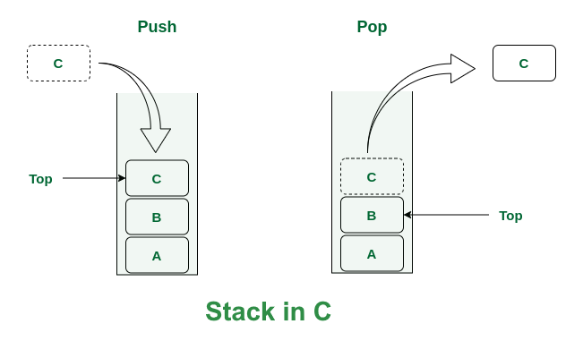

# 📌 Stack（堆疊）

## 1. Definition

Stack 是一種 LIFO（Last In First Out）的線性資料結構。

元素只能從頂端（top）進行插入與刪除。

---

## 2. Core Idea

Stack 的本質：

> 限制操作位置（只允許在 top 操作）

---

## 3. Operations

- push(x) → 加入元素
- pop() → 移除頂端元素
- peek() → 查看頂端元素
- isEmpty() → 是否為空
- isFull() → 是否已滿（array）

---

## 4. Implementation Types

### (1) Array-based

- 使用連續記憶體
- 使用 index（top）控制

優點：

- O(1)
- cache friendly

缺點：

- 固定大小（overflow）

---

### (2) Dynamic Array（malloc）

- 使用 heap 記憶體
- 可動態配置

優點：

- 彈性

缺點：

- 需要手動管理記憶體（free）

---

### (3) Linked List

- 每個節點指向下一個
- top 指向 head

優點：

- 無容量限制

缺點：

- pointer 操作複雜
- 記憶體分散

---

## 5. State Representation（Array）

| top | 狀態       |
| --- | ---------- |
| -1  | 空         |
| 0   | 1 個元素   |
| n   | n+1 個元素 |

---

## 6. Complexity

| Operation | Time |
| --------- | ---- |
| push      | O(1) |
| pop       | O(1) |
| peek      | O(1) |

Space：O(n)

---

## 7. Edge Cases

- 單一元素
- 空 stack
- Stack Overflow（容量已滿）
- Stack Underflow（空 stack）

---

## 8. Common Mistakes

- 忘記檢查 empty
- top 更新錯誤
- malloc 沒 free
- index 越界

---

## 9. Use Cases

- Function call stack
- Expression evaluation
- DFS
- Undo / Redo

---

## 10. Implementation

👉 See:

- array.md
- dynamic_array.md
- linked_list.md

---

## 11. Insight

- Stack = array + restriction
- top 是唯一狀態控制點
- pointer 讓 stack 可以動態化
